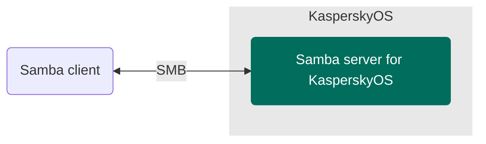

# KasperskyOS Samba server example

> An example of a KasperskyOS-based solution using a Samba server.

## Table of contents
- [KasperskyOS Samba server example](#kasperskyos-samba-server-example)
  - [Table of contents](#table-of-contents)
  - [Solution overview](#solution-overview)
    - [List of programs](#list-of-programs)
    - [Solution scheme](#solution-scheme)
    - [Initialization description](#initialization-description)
    - [Security policy description](#security-policy-description)
  - [Getting started](#getting-started)
    - [Prerequisites](#prerequisites)
    - [Building the example](#building-the-example)
  - [Usage](#usage)

## Solution overview

### List of programs

* `NetInit`—Program that initializes the network interface `en0`
* `Smbd`—Samba server ported to KasperskyOS
* `VfsNet`—Program that is used for working with the network
* `Dhcpcd`—DHCP client implementation program that gets network interface parameters from an external
DHCP server in the background and passes them to the virtual file system
* `VfsRamFs`—Program that supports RamFS file system
* `BSP`—Driver for configuring pin multiplexing parameters (pinmux)
* `RAMDisk`—Block device driver of a virtual drive in RAM

### Solution scheme



### Initialization description

<details><summary>Statically created IPC channels</summary>

* `samba.Smbd` → `kl.VfsRamFs`
* `samba.Smbd` → `kl.VfsNet`
* `kl.VfsNet` → `kl.drivers.BSP`
* `kl.rump.Dhcpcd` → `kl.VfsRamFs`
* `kl.rump.Dhcpcd` → `kl.VfsNet`
* `kl.VfsRamFs` → `kl.drivers.RAMDisk`

</details>

The [`./einit/src/init.yaml.in`](einit/src/init.yaml.in) template is used to automatically generate
a part of the solution initialization description file `init.yaml`. For more information about the
`init.yaml.in` template file, see the
[KasperskyOS Community Edition Online Help](https://click.kaspersky.com/?hl=en-us&link=online_help&pid=kos&version=1.3&customization=KCE&helpid=cmake_yaml_templates).

### Security policy description

The [`./einit/src/security.psl.in`](einit/src/security.psl.in) template is used to automatically generate part of the solution security policy description file `security.psl`. For more information about the `security.psl.in` file, see
[KasperskyOS Community Edition Online Help](https://click.kaspersky.com/?hl=en-us&link=online_help&pid=kos&version=1.3&customization=KCE&helpid=cmake_psl_templates).

[⬆ Back to Top](#Table-of-contents)

## Getting started

### Prerequisites

1. Make sure that you have installed the latest version of the [KasperskyOS Community Edition SDK](https://os.kaspersky.com/development/).
1. Set the `SDK_PREFIX` environment variable to `/opt/KasperskyOS-Community-Edition-<version>`,
where `version` is the version of the KasperskyOS Community Edition SDK that you installed. To do this,
run the following command:
   ```
   $ export SDK_PREFIX=/opt/KasperskyOS-Community-Edition-<version>
   ```

### Building the example

The Samba server for KasperskyOS is built using the CMake build system, which is provided in the
KasperskyOS Community Edition SDK.

To build the example to run on QEMU, go to the directory with the example and run the following command:
```
$ ./cross-build.sh qemu
```
To build an example to run on a Raspberry Pi 4 B or Radxa ROCK 3A, use the following command:
```
$ ./cross-build.sh hw
```
Running `cross-build.sh` creates a KasperskyOS-based solution image that includes the example. The `kos-qemu-image` or `kos-image` solution image is located in the `./build/einit` directory.

[./netinit/CMakeLists.txt](netinit/CMakeLists.txt)—CMake commands for building the `NetInit` program.

[./einit/CMakeLists.txt](einit/CMakeLists.txt)—CMake commands for building the `Einit` program and
the solution image.

[./CMakeLists.txt](CMakeLists.txt)—CMake commands for building the solution.

## Usage

1. To run the example on QEMU, go to the directory with the Samba server example
and run the following command:
   ```
   $ ./cross-build.sh qemu
   ```
   For more information about running example on Raspberry Pi 4 B or Radxa ROCK 3A see the following [link](https://click.kaspersky.com/?hl=en-us&link=online_help&pid=kos&version=1.3&customization=KCE&helpid=running_sample_programs_rpi).
1. Wait for messages to stop appearing in the standard output.
1. A test account is implemented on a Samba server for a user with the following credentials:
user name `user` and password `1234`.
   Connect to the running Samba server using any Samba client available to you. For example, run
the following command:
   ```
   $ smbclient //localhost/tmp --user=user --port=1490
   ```
1. As a result, you will get access to a shared resource that is determined by the contents
of the directory `./resources/hdd/srv`.

[⬆ Back to Top](#Table-of-contents)
